  <h3><code>yz174@github ~ $ ./contributions.sh</code></h3>
  
    

  <h3><code>yz174@github ~ $ whoami</code></h3>
  <table>
    <tr>
      <td valign="top"></td>
      <td valign="top"></td>
    </tr>
  </table>
  
<i>A CSE undergrad who builds fast and breaks things (on purpose). Full-stack, systems, and security, always shipping..</i>

   

  <h3><code>yz174@github ~ $ cat stack.txt</code></h3>
  

    
    
    
    
  

  

    
    
    
    
    
    
  

  

    
    
    
    
  

  

    
    
    
    
    
    
  

  

    
    
  

